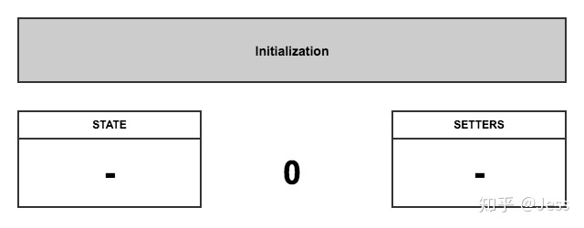

#30分钟精通React Hooks
```
# 安装
$ yarn global add umi # 或者 npm install -g umi

# 新建应用
$ mkdir react-hooks && cd react-hooks

# 新建页面
$ umi generate page index

# 本地开发
$ umi dev

# 构建上线
$ umi build
```
Hooks 顾名思义，字面意义上来说就是 React 钩子的概念。拥有了hooks，你再也不需要写Class了，你的所有组件都将是Function。既然没有了class，就没有了this。
搞不清使用哪个生命周期钩子函数？ ——拥有了Hooks，生命周期钩子函数可以先丢一边了。
 为组件中的this指向而晕头转向吗？ ——既然Class都丢掉了，哪里还有this？你的人生第一次不再需要面对this。
 解决的问题：
1、不用写class,
2、不用关心this指向
3、不用关心生命周期
4、状态共享

class组件
```
import styles from "./index.css";

class Example extends React.Component {
  constructor(props) {
    super(props);
    this.state = {
      count: 0
    };
  }

  render() {
    return (
      <div className={styles.classDome}>
        <h1>Class Dome</h1>
        <p>You clicked {this.state.count} times</p>
        <button onClick={() => this.setState({ count: this.state.count + 1 })}>
          Click me
        </button>
      </div>
    );
  }
}
export default Example;

```

同样的功能hooks写法
```
import { useState, useEffect } from "react";
import styles from "./index.css";

function Example() {
  const [count, setCount] = useState(0);
	console.log('useState(0):', count, setCount)
	  // 类似于componentDidMount 和 componentDidUpdate:
	useEffect(() => {
		// 更新文档的标题
		document.title = `clicked ${count} times`;
	});
  return (
    <div className={styles.hooksDome}>
      <h1>Hooks Dome</h1>
      <p>You clicked {count} times</p>
      <button onClick={() => setCount(count + 1)}>Click me</button>
    </div>
  );
}
export default Example;

```

看到这里 会有一个疑问，为啥useState(0)，每次都是递增的，Example也只是一个函数而已，应该每次都会销毁，重新赋值啊，（不考虑闭包）
```
function add(n) {
    const result = 0;
    return result + 1;
}

add(1); //1
add(1); //1

```
其实是react-hooks做了记住历史值，当函次再次执行的时候，都是拿的上一次执行完的状态值作为初始值。

新的问题 hooks是怎么记住历史值的呢？

## 多个状态值
上面的例子 我们只有一个  `const [count, setCount] = useState(0)`;但很多情况 我们是需要多个状态值的

```
import { useState, useEffect } from "react";
import styles from "./index.css";

function Example() {
  const [count, setCount] = useState(0);
  const [fruit, setFruit] = useState('banana');
  const [todos, setTodos] = useState([{ text: 'Learn Hooks' }]);
  return (
    <div className={styles.hooksDome}>
      <h1>Hooks Dome</h1>
      <p>You clicked {count} times</p>
      <p>水果：{fruit} </p>
      <p>todos：{todos} </p>
      <button onClick={() => setCount(count + 1)}>Click me</button>
    </div>
  );
}
export default Example;

```
如果上面的代码改成下面的 
```
let firstRender = true;

function Example() {
  const [count, setCount] = useState(0);
  if(firstRender){
    const [fruit, setFruit] = useState('banana');
    firstRender = false;
  }
// react-dom.development.js:16332 Uncaught Error: Rendered fewer hooks than expected. This may be caused by an accidental early return statement.
// 呈现的钩子比预期的少。这可能是由于意外的提前返回语句造成的。
```
为啥会出现这个问题呢？

# 让我们揭开hooks神秘的面纱

## hooks的原则
react团队在怎么使用hooks的 官方文档 中，强调了两点主要的使用原则：

- 不要 在 循环、条件语句或者嵌套函数中调用hooks
- 只能在 React 函数组件中调用hooks

## hooks中的state管理，只是在操作数组

让我们来想想react内部会怎么来实现 useState 呢。在下面的实现里，state 是存放在被render的组件外面，并且这个state不会和其他组件共享，同时，在这个组件后续render中，能够通过特定的作用域方式，访问到这个state。

1) state初始化

创建两个空数组，分别用来存放 setters 和 state，将 指针 指到 0 的位置：


2) 组件首次render

当首次render这个函数组件的时候。

每一个 useState 调用，当 首次 执行的时候，在 setter 数组里加入一个 setter 函数(和对应的数组index关联)；然后，将 state 加入对应的 state 数组里：

 const [count, setCount] = useState(0);
 
state|setter|index
---|:--:|---:
count|setCount|0


组件后续(非首次)render

后续组件的每次render，指针都会重置为 0 ，每调用一次 useState，都会返回指针对应的两个数组里的 state 和 setter，然后将指针位置 +1。

3)第二次render
 const [fruit, setFruit] = useState('banana');
state|setter|index
---|:--:|---:
count|setCount|0
fruit|setFruit|1

4)第三次次render
  const [todos, setTodos] = useState([{ text: 'Learn Hooks' }]);
state|setter|index
---|:--:|---:
count|setCount|0
fruit|setFruit|1
todos|setTodos|2